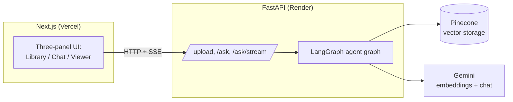
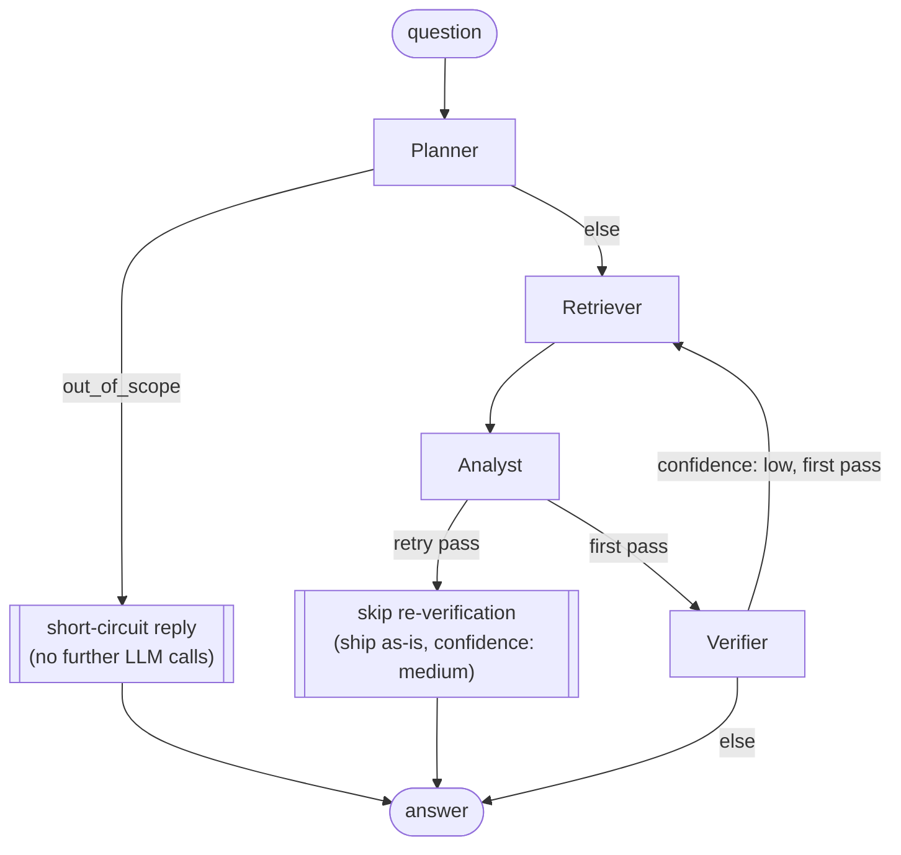

# Quorum

A team of AI agents that read, cross-check, and answer from your PDFs.

Upload one or more PDFs, select which ones a question should run against,
and watch a Planner, Retriever, Analyst, and Verifier work through it live —
each one's step streamed to the UI as it happens — before you get a cited,
confidence-scored answer.

## Why multi-agent?

The original version of this project (v1) was a single Gemini call: embed
the question, pull the top-K chunks from Pinecone, stuff them into one
prompt, done. That's fast and cheap, but it has three structural limits that
don't go away by tuning the prompt:

- **No self-correction.** If retrieval missed the right chunk, the model
  just answers confidently from what it got. There's no step that notices
  "these excerpts don't actually support this claim" and does something
  about it.
- **One shape for every question.** "What's the refund policy?" and
  "compare the two contracts' termination clauses" get the same treatment,
  even though the second one needs a different retrieval and answer
  strategy entirely.
- **One document at a time.** The old `/ask` took a single `document_id`;
  there was no way to ask a question that spans multiple PDFs.

Splitting the pipeline into agents with one clear job each fixes all three:
a **Planner** classifies the question and picks a strategy up front, a
**Retriever** can pull from several documents and merge results, an
**Analyst** writes the answer, and a **Verifier** checks it against the
source material and can send it back for another retrieval pass if it isn't
supported. The tradeoff is more moving parts and more LLM calls — which is
why the call budget below is a hard constraint, not an afterthought.

## Architecture



| Layer            | Tech                              | Deployed to     |
|-------------------|-----------------------------------|-----------------|
| Frontend          | Next.js 14 + Tailwind             | Vercel          |
| Backend / API     | FastAPI + LangGraph               | Render          |
| Vector storage    | Pinecone                          | Pinecone cloud  |
| Embeddings / LLM  | Gemini (free tier)                | called from backend only |

Vercel's serverless functions are stateless between invocations with no
local disk, but a RAG pipeline needs the vectors created during `/upload`
to still exist when `/ask` runs later, possibly on a different instance.
Render runs the FastAPI app as a normal long-lived process, which is the
natural home for the real compute (PDF parsing, the agent graph, calling
Gemini and Pinecone) — but the backend itself still holds no state across
requests. Everything that needs to survive a cold start, a redeploy, or a
scaled-out instance lives in **Pinecone**, and the list of "documents
you've uploaded" lives in the **browser's localStorage**, since the backend
never persists it either.

### The agent graph



1. **Planner / Router** (1 LLM call) — classifies the question as
   `simple_lookup`, `summary`, `comparison`, `multi_hop`, or `out_of_scope`;
   rewrites follow-ups into a standalone question using recent chat history
   (so "what about page 3?" resolves correctly); produces 1–3 search
   queries for the Retriever.
2. **Retriever** (no LLM call) — embeds each sub-query, queries Pinecone per
   selected document namespace, merges and de-duplicates the results, keeps
   the top-K by score. For `summary` questions it instead samples a spread
   of chunks across the whole document, since a single query vector would
   over-focus on one part of it.
3. **Analyst / Synthesizer** (1 LLM call) — writes the answer from the
   retrieved chunks only, with inline citations like `[Doc name, p.4]`,
   streaming tokens as they're generated. For `comparison` questions it
   structures the answer as a per-document breakdown plus a synthesis.
4. **Verifier / Critic** (1 LLM call) — checks every claim in the draft
   against the retrieved chunks, flags anything unsupported, and returns a
   confidence score (`high` / `medium` / `low`).
5. **The one retry** — if confidence comes back `low` on the *first* pass,
   the graph loops back to the Retriever with a wider top-K and re-runs the
   Analyst (1 more LLM call). That second answer ships **without** a second
   Verifier call and its confidence is downgraded to `medium` — re-verifying
   would make the worst case 5 LLM calls per question, and Gemini's free
   tier doesn't have the headroom for that.
6. `out_of_scope` questions short-circuit right after the Planner with a
   polite "not in these documents" reply — zero further LLM or Pinecone
   calls.

**LLM call budget: at most 4 per question** (Planner, Analyst, Verifier,
plus one retry Analyst) — a hard constraint given Gemini's free-tier rate
limits, not just a performance nicety. Every Gemini call in the codebase
(embeddings included) goes through a shared retry-with-backoff wrapper
(`backend/app/llm.py`) that retries 429s with exponential backoff + jitter.

Every agent appends a `{agent, status, summary, duration_ms}` trace event to
the shared graph state as it finishes; `/ask/stream` forwards these as SSE
events in real time, which is what powers the live trace timeline in the
UI.

## Project structure

```
RAG_pdf/
├── backend/                        FastAPI app
│   ├── app/
│   │   ├── agents/
│   │   │   ├── state.py            QuorumState TypedDict shared across nodes
│   │   │   ├── planner.py          classify + rewrite + sub-queries (1 LLM call)
│   │   │   ├── retriever.py        embed + Pinecone query + merge/dedupe (no LLM)
│   │   │   ├── analyst.py          cited answer, streamed (1 LLM call)
│   │   │   ├── verifier.py         confidence check + single-retry gate (1 LLM call)
│   │   │   └── graph.py            LangGraph wiring
│   │   ├── llm.py                  shared Gemini client + 429 retry/backoff
│   │   ├── sse.py                  turns a graph run into SSE-ready events
│   │   ├── summary.py              one-shot document overview (title/key points/questions)
│   │   ├── config.py                env vars / settings
│   │   ├── pdf_processor.py        text extraction + chunking
│   │   ├── embeddings.py           Gemini embeddings wrapper
│   │   └── vector_store.py         Pinecone upsert/query/delete (cached index handle)
│   ├── tests/                      pytest, Gemini/Pinecone mocked
│   ├── main.py                     FastAPI routes
│   ├── requirements.txt / requirements-dev.txt
│   └── .env.example
├── frontend/                        Next.js app
│   ├── app/                         layout, page (3-panel shell), theming
│   ├── components/
│   │   ├── library/                 upload dropzone, document list
│   │   ├── chat/                    chat panel, markdown bubbles, citations, confidence
│   │   ├── trace/                   animated agent trace timeline
│   │   ├── viewer/                  PDF viewer (react-pdf)
│   │   └── icons/                   Quorum logo
│   ├── lib/
│   │   ├── api.ts                   fetch client + SSE stream parser
│   │   └── storage.ts               localStorage-backed document library
│   ├── scripts/copy-pdf-worker.mjs  copies the pdf.js worker into public/
│   └── types/index.ts
├── render.yaml                      Render Blueprint for the backend
└── README.md
```

## API

### `POST /upload`

`multipart/form-data`, field `file` (a PDF). Extracts text per page,
chunks it (~800 tokens, 100 overlap), embeds each chunk with
`gemini-embedding-001`, and upserts into a Pinecone namespace named after a
freshly generated `document_id`. `doc_name` (derived from the filename) and
`num_pages` are stamped onto every chunk's metadata, so later Pinecone
lookups don't need a separate store.

```json
{ "document_id": "...", "doc_name": "Q3 Report", "num_chunks": 42, "num_pages": 12 }
```

### `POST /ask`

Runs the full agent graph and returns once it's done (no intermediate
events). Same request body as `/ask/stream` below.

```json
{
  "final_answer": "...",
  "citations": [{ "doc_id": "...", "doc_name": "Q3 Report", "page": 4, "snippet": "..." }],
  "confidence": "high",
  "trace": [{ "agent": "planner", "status": "completed", "summary": "...", "duration_ms": 812 }]
}
```

### `POST /ask/stream`

Same request, streamed as Server-Sent Events instead:

```json
{ "document_ids": ["..."], "question": "...", "history": [{ "role": "user", "content": "..." }] }
```

Event types, in emission order:

| Event   | Payload                                                        | Meaning |
|---------|-----------------------------------------------------------------|---------|
| `trace` | `{agent, status, summary, duration_ms}`                        | One agent finished a step. |
| `token` | `{text}`                                                        | One chunk of the Analyst's streamed answer. |
| `reset` | `{}`                                                            | A 429 forced the Analyst to restart streaming — discard buffered text so far. |
| `final` | `{final_answer, citations, confidence}`                         | The graph is done. |
| `error` | `{detail}`                                                      | Something failed; no further events follow. |

The frontend can't use `EventSource` here since it can't send a POST body —
`lib/api.ts`'s `streamAsk` reads the response with `fetch` +
`ReadableStream` instead.

### `DELETE /documents/{document_id}`

Deletes the document's Pinecone namespace entirely.

### `POST /documents/{document_id}/summary`

One-shot overview used by the frontend right after upload: a guessed title,
5 key points, and 3 suggested questions, generated from a spread of chunks
across the document (not the agent graph — it's a single LLM call, not a
question to route or verify).

### `GET /health`

Liveness check; also what the frontend pings on load to detect a
Render free-tier cold start.

## Prerequisites

- Python 3.11+
- Node.js 18.18+
- A [Gemini API key](https://aistudio.google.com/apikey) (free, no credit
  card required)
- A [Pinecone](https://app.pinecone.io) account and API key

You don't need to manually create the Pinecone index — the backend creates
it automatically (1536 dimensions, cosine metric) on first use if it
doesn't already exist.

## Running locally

### Backend

```bash
cd backend
python -m venv venv
venv\Scripts\activate          # Windows
# source venv/bin/activate     # macOS/Linux

pip install -r requirements-dev.txt   # includes requirements.txt + test tools
copy .env.example .env         # then fill in GEMINI_API_KEY and PINECONE_API_KEY
uvicorn main:app --reload --port 8000
```

Check `http://localhost:8000/health`. Run the tests with `pytest` (Gemini
and Pinecone are mocked, so no API keys are needed for the test suite
itself — just set placeholder env vars if `app.config` complains at import
time).

### Frontend

```bash
cd frontend
npm install                    # also copies the pdf.js worker into public/
copy .env.example .env.local   # NEXT_PUBLIC_API_URL=http://localhost:8000
npm run dev
```

Open `http://localhost:3000`.

## Deploying

### Backend -> Render

1. Push this repo to GitHub.
2. In the Render dashboard: **New -> Blueprint**, point it at the repo. It
   picks up [`render.yaml`](render.yaml): a Python web service named
   `quorum-backend`, rooted at `backend/`.
3. Set the environment variables Render prompts for (`sync: false` in
   `render.yaml`, so they're not committed):
   - `GEMINI_API_KEY`
   - `PINECONE_API_KEY`
   - `PINECONE_INDEX_NAME`
   - `ALLOWED_ORIGINS` — your Vercel URL, comma-separated with
     `http://localhost:3000` if you also want local frontend dev to work
     against the deployed backend.
4. Deploy. Note the resulting service URL (e.g.
   `https://quorum-backend.onrender.com`).

**Redeploying an existing v1 install:** if you already had the single-call
version running, `render.yaml` previously declared `OPENAI_API_KEY` even
though the app only ever read `GEMINI_API_KEY` — that's fixed now, but if
Render's dashboard still shows the old `OPENAI_API_KEY` env var from a
prior blueprint sync, it's harmless to leave or safe to delete.

**Can you reuse your existing Pinecone index?** Yes, as long as it's still
1536 dimensions (it is, if it was created by the v1 app). Documents
uploaded under v1 won't have `doc_name`/`num_pages` in their chunk
metadata, though, since that's new in this version — `vector_store.py`
falls back to `"Untitled document"` for those, and the document library
won't show them at all (it's localStorage-only, so anything uploaded before
this redesign was never in it to begin with). Re-upload old PDFs if you
want them to show up with proper names.

### Frontend -> Vercel

1. In the Vercel dashboard: **New Project**, import the repo, root
   directory `frontend`.
2. Vercel auto-detects Next.js (`frontend/vercel.json` pins the
   build/dev/install commands explicitly). `npm install` also runs
   `scripts/copy-pdf-worker.mjs` via `postinstall`, so the PDF viewer's
   worker file ends up in `public/` automatically — no extra Vercel config
   needed.
3. Add an environment variable:
   - `NEXT_PUBLIC_API_URL` = your Render backend URL (e.g.
     `https://quorum-backend.onrender.com`)
4. Deploy, then go back to Render and add the resulting Vercel URL to
   `ALLOWED_ORIGINS` so CORS allows requests from it.

## Notes on the free tiers

- **Gemini free tier** has tight per-minute rate limits — see the call
  budget above and `backend/app/llm.py`'s retry/backoff. If you still hit
  429s under real usage, the fix is to slow down, not to raise the call
  budget.
- **Render's free web services** spin down when idle and take ~30–60s to
  wake on the next request. The frontend pings `/health` on load and shows
  a "waking up the agents…" banner if it's slow.
- **Pinecone's free tier** is fine at this scale; one shared index with
  per-document namespaces avoids needing an index per PDF.
- **No PDF storage**: the backend never keeps the original PDF bytes (only
  extracted text goes into Pinecone), so the frontend's PDF viewer can only
  render a document that's still in the browser's memory from the current
  session's upload. Reload the page or revisit an old document, and the
  viewer shows a fallback message — chat and citations still work, since
  those only need the text that's in Pinecone.
